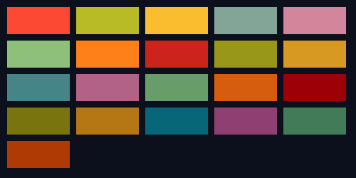

## Gruvbox

### Credits
[Morhetz)](https://github.com/morhetz/gruvbox)

### Colors
bright Red     = #fb4934  
bright_green   = #b8bb26  
bright_yellow  = #fabd2f   
bright_blue    = #83a598  
bright_purple  = #d3869b  
bright_aqua    = #8ec07c  
bright_orange  = #fe8019  
neutral_red    = #cc241d  
neutral_green  = #98971a  
neutral_yellow = #d79921  
neutral_blue   = #458588  
neutral_purple = #b16286  
neutral_aqua   = #689d6a  
neutral_orange = #d65d0e  
faded_red      = #9d0006  
faded_green    = #79740e  
faded_yellow   = #b57614  
faded_blue     = #076678  
faded_purple   = #8f3f71  
faded_aqua     = #427b58  
faded_orange   = #af3a03  

### Sample Image

